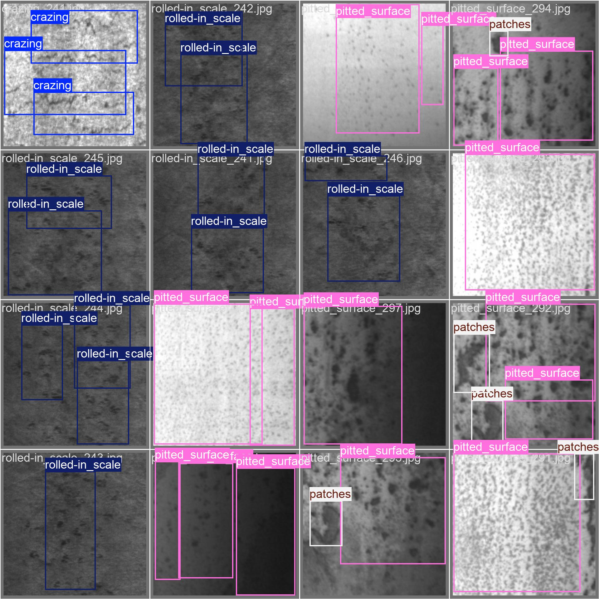
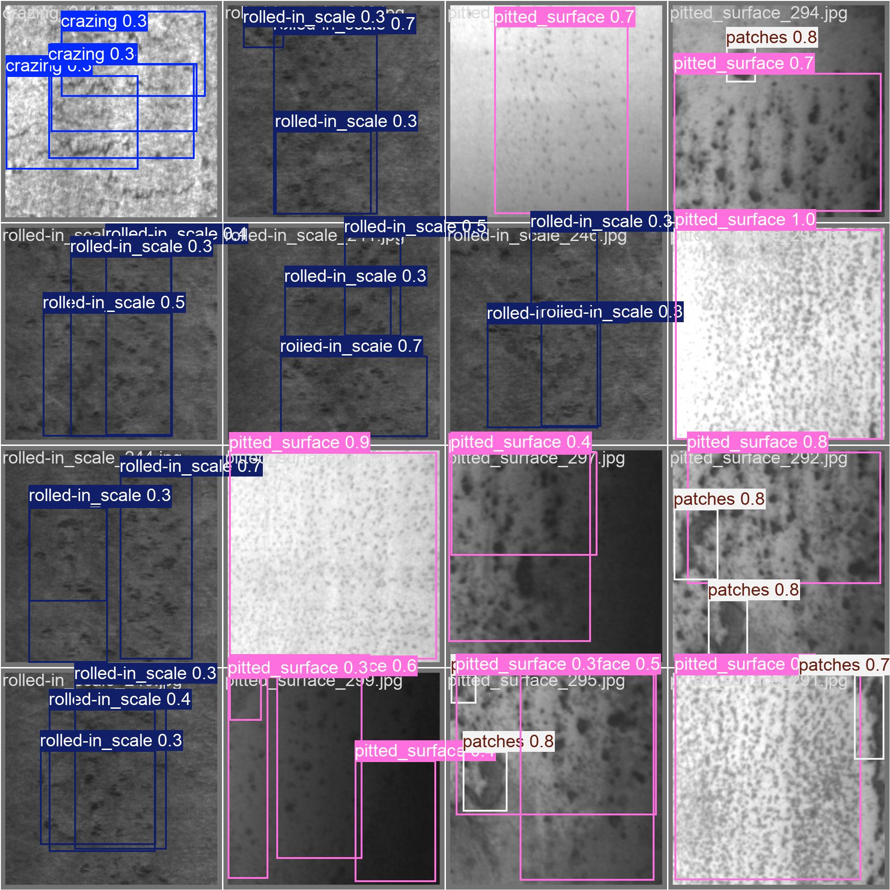

🛠️ YOLO-NEU Defect Detection

Industrial surface defect detection using YOLOv8 on the NEU Surface Defect Dataset.
This project demonstrates an end-to-end computer vision pipeline for defect detection in manufacturing environments.

_____________________________________________________________________________________________________________________

📌 Project Overview

Surface defect detection is a critical task in industrial quality inspection.
In this project, a YOLOv8 object detection model is trained to detect multiple defect types on steel surfaces from the NEU dataset.

The pipeline includes:

Dataset preparation and annotation conversion (VOC ➜ YOLO)

Training and validation using Ultralytics YOLOv8

Evaluation using Precision, Recall, and mAP

Qualitative visual results

_______________________________________________________________________________________________________________________

🧠 Model

Architecture: YOLOv8

Task: Object Detection

Input size: 640×640

Trained on: CPU

Epochs: 100

_______________________________________________________________________________________________________________________

📊 Results

After 100 epochs (CPU training):

Metric	Score
Precision	73%
Recall	66%
mAP@50	73%

Interpretation:

The model correctly detects ~73 out of every 100 predicted defects.

It successfully finds ~66% of all actual defects in images.

Strong performance for a lightweight model trained on CPU.

_______________________________________________________________________________________________________________________

📸 Demo Results

Example predictions on validation images:

